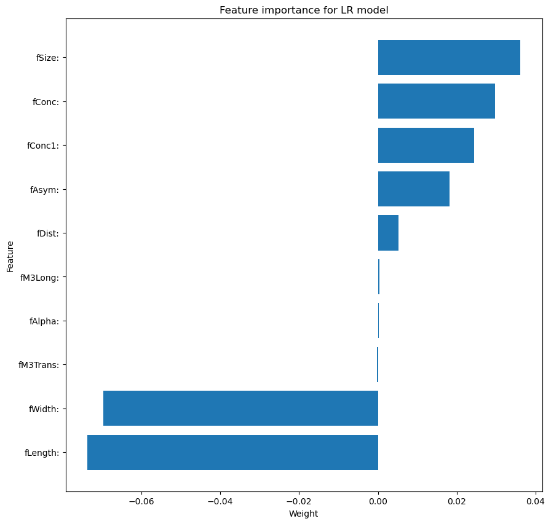
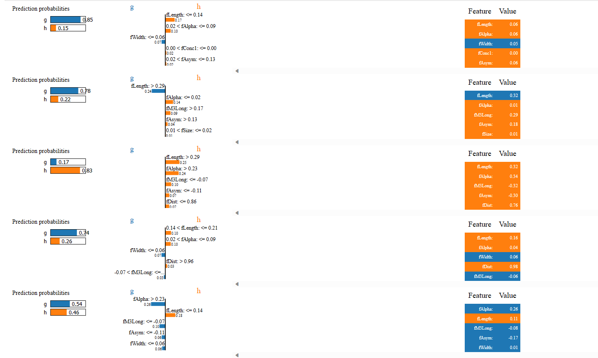
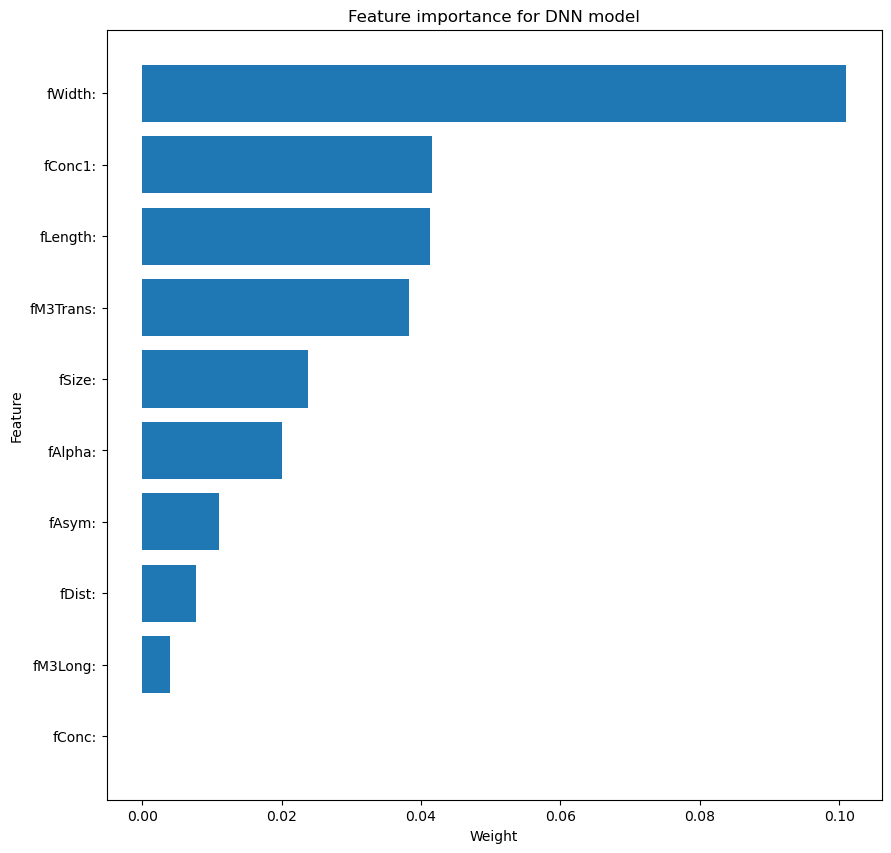
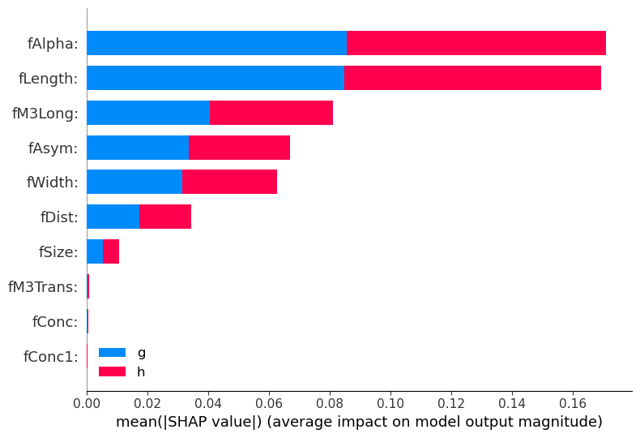
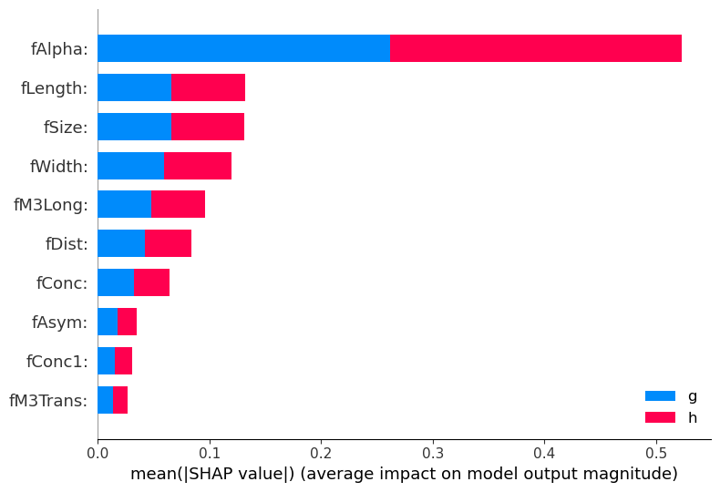

# Homework 3

# 3. Decompositions using LIME

I have ran decompositions, on linerar model and DNN

From observations on few samples, I think that linear model explanations are much more chaotic wheras, for DNN, features like Alptha, Length, Width, Dist, M3Long were consistently important. ( I think this might be due to convolving nature of DNN where as in linear model, features are used in a more direct way)

I also have ran LIME using larger number of samples (1000), with a goal to try to establish some larger patterns. 

By cross checking with values comming from SHAP, I think those graphs give reasonable results And show the relative importance of features. (see abs of values, as some are negatively correlated with the class)

I used explanation.to_map(), but I might be missusing this function.
As weights displayed by show_in_notebook() are a bit different than those displayed by to_map(). Documentation didn't help me to understand the difference.

To see lime features show_in_notebook style see attached html file.

LIME features for linear regression model (5 samples)

LIME summed weights for linear regression model

LIME features for DNN model (5 samples)

LIME summed weights for DNN model

# 4. Decompositions using SHAP

First big observation is that SHAP is much slower than LIME. I think it might have quadratic complexity, so I have ran it only on 100 samples.

Due to how my code is structured, SHAP explanations are sorted by the feature importance. But I might be a bit hard to read which feature suggests which class. I'm not sure if this is expected but it looks like all the features have similar importance to both classes.

Something that I also noticed is that DNN models makes much more equal use of all the features, whereas linear model is much more focused on a few features. This is visible in both LIME and SHAP explanations. 

SHAP for linear regression model

SHAP for DNN model

# 5. Comparasions of Linear regression and DNN

Due to the nature of LR model, it's quite limited in what it can encode, and it will struggle with interactions between features. I this is shown by very low weights of some of the features.

The DNN is capable of taking adavantage of all the features, and no feature has weight very close to 0(tho most of them have weights quite close to 0).

This is also visible in much higher accuracy of DNN model. (0.72 vs 0.82)

Something that both models have in common is that fAlpha is the most important feature. And generally "rough" ordering of features by importance is the same for both models. 

