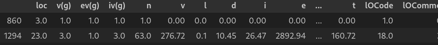
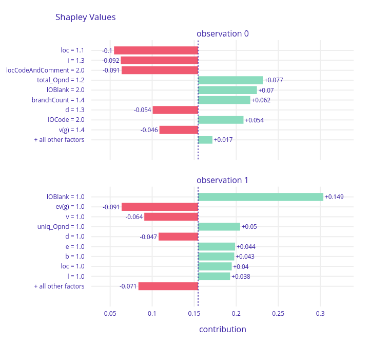
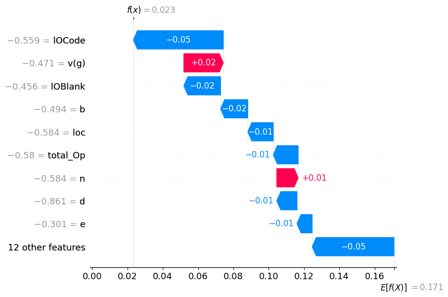
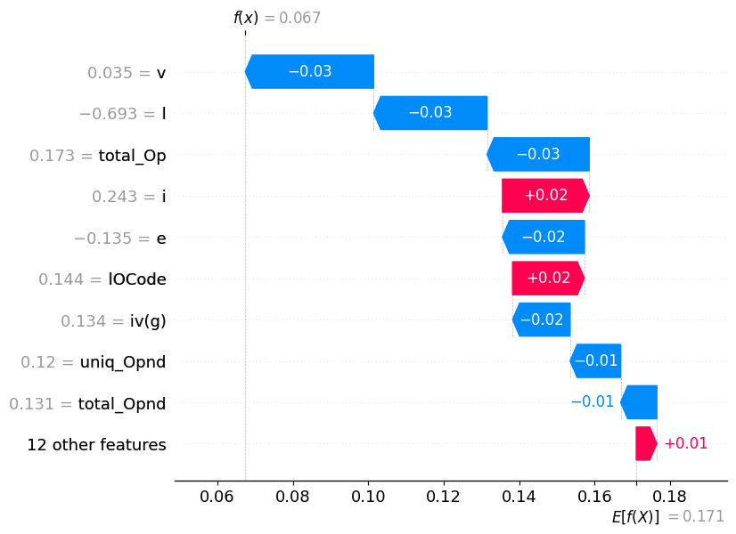
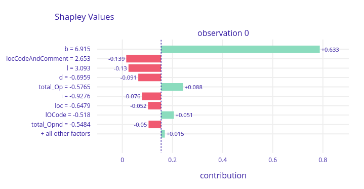

# HW4 Report - Szymon Sadkowski

## TASK A

### 1. Train a tree-based ensemble model on the selected dataset; it can be one of random forest, GBM, CatBoost, XGBoost, LightGBM (various types) etc.

I choose xgboost on `kc1` dataset. Performance `0.78` roc_auc.

### 2. Select two observations from the dataset and calculate the model's prediction.
  
Model predictions for those are [0.02337096, 0.06738389] respectivly (Prob of true).  
  

### 3. Next, for the same observations, calculate the decomposition of predictions, so-called variable attributions, using SHAP from two packages of choice, e.g. for Python: `dalex` and `shap`, for R: `DALEX` and `iml`.

I did that for `dalex` and 'shap' library and got following results
1. dalex    
  
2. shap  

  


### 4. Find any two observations in the dataset, such that they have different variables of the highest importance, e.g. age and gender have the highest (absolute) attribution for observation A, but race and class are more important for observation B.

Thats the case for datapoints  

as we can see above

### 5. (If possible) Select one variable X and find two observations in the dataset such that for one observation, X has a positive attribution, and for the other observation, X has a negative attribution.

I could not find such cases when analyzing random 30 explanations

### 6. (How) Do the results differ across the two packages selected in point (3)?
They look completly different. I'm not sure why there is such a discrepancy.

### 7. (Using one explanation package of choice) Train another model of any class: neural network, linear model, decision tree etc. and find an observation for which SHAP attributions are different between this model and the one trained in point (1).

I trained linear regression from sklearn and calculated shap values using `dalex` lib and obtained such shap values.  
  
Linear regression shap explanation look much different for datapoint above. In Linear regression most important feature is 'b' and for xgboost 'i'

## TASK B

Calculate Shapley values for player A given the following value function

```
v() = 0
v(A) = 20
v(B) = 20
v(C) = 60
v(A,B) = 60
v(A,C) = 70
v(B,C) = 70
v(A,B,C) = 100
```

```
Φ_a = 1/6 (20 * 2 + 40 + 10 + 30 + 30) = 25
Φ_b = 1/6 (20 * 2 + 40 + 10 + 30 + 30) = 25
Φ_c = 1/6 (60 * 2 + 50 + 50 + 40 + 40) = 50
```
