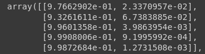
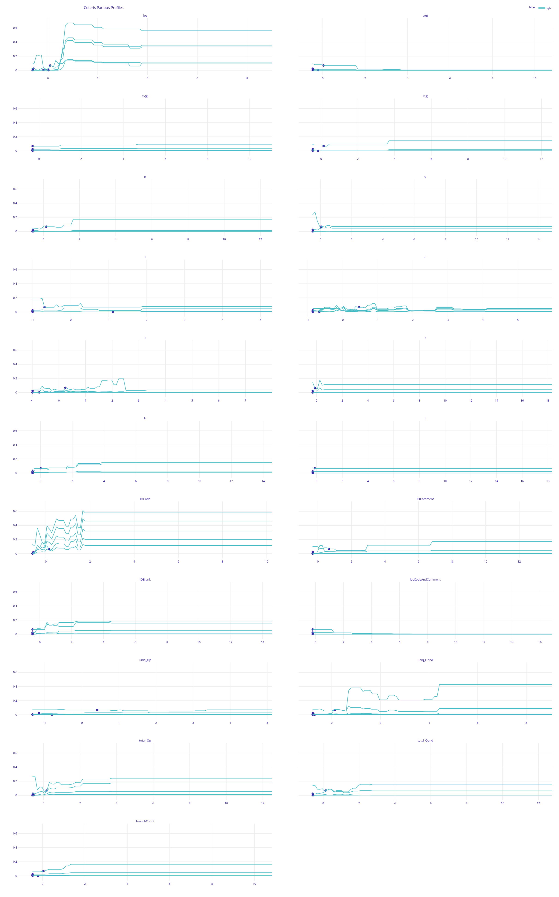
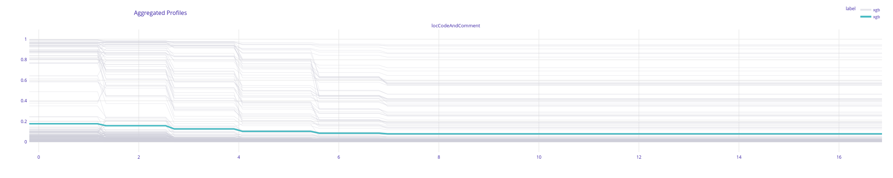

# HW 5 - Szymon Sadkowski

## Task 1

f(x1, x2) = (x1 + x2)^2

Assume that x1, x2 ~ U[-1,1] and x1=x2 (full dependency)

Calculate PD profile for variable x1 in this model.

$G_{PD}^1(z) = E_{x_2}[(z + x_2)^2] = E_{x_2}[z^2 + 2zx_2 + (x_2)^2] = z^2 + 2z * {E_2}(x_2) + E_{X_2} = z^2 + 2z * 0 + \int_{-1}^{1}1/2 * {x_2}^2 = z^2 + 0 + \dfrac{1}{3}= z^2 + \dfrac{1}{3}$

$G_{MP}^{1}(z) = E_{x_2|x_1 = z}[(z + z)^2] = 4z^2$  

$G_{ALE}^1(z) = \int_{-1}^z[E_{x_2|x_1 = v}[\dfrac{∂((x_1 + x_2)^2)}{∂x_1}]] dv
= \int_{-1}^z[E_{x_2|x_1 = v}[2x_1 + 2x_2]]dv = \int_{-1}^z[E_{x_2|x_1 = v}[4v]]dv = 
\int_{-1}^z[4v]dv = (2v^2 + c)|_{-1}^z = 2z^2 - 2(-1)^2 = 2z^2 - 2$

## Task 2

### 0. For the selected data set, train at least one tree-based ensemble model, e.g. random forest, gbdt, xgboost.

I trained as in HW1 xgboost and logistic regression on `kl1` dataset.

---

### 1. Calculate the predictions for some selected observations.

I have randomly chosen 5 samples from dataset

|index|loc|v\(g\)|ev\(g\)|iv\(g\)|n|v|l|d|i|e|b|t|lOCode|lOComment|lOBlank|locCodeAndComment|uniq\_Op|uniq\_Opnd|total\_Op|total\_Opnd|
|---|---|---|---|---|---|---|---|---|---|---|---|---|---|---|---|---|---|---|---|---|
|860|3\.0|1\.0|1\.0|1\.0|1\.0|0\.0|0\.0|0\.0|0\.0|0\.0|0\.0|0\.0|1\.0|0\.0|0\.0|0\.0|1\.0|0\.0|1\.0|0\.0|
|1294|23\.0|3\.0|1\.0|3\.0|63\.0|276\.72|0\.1|10\.45|26\.47|2892\.94|0\.09|160\.72|18\.0|3\.0|0\.0|0\.0|10\.0|11\.0|40\.0|23\.0|
|1130|15\.0|1\.0|1\.0|1\.0|0\.0|0\.0|0\.0|0\.0|0\.0|0\.0|0\.0|0\.0|0\.0|0\.0|0\.0|0\.0|0\.0|0\.0|0\.0|0\.0|
|1095|21\.0|2\.0|1\.0|2\.0|0\.0|0\.0|0\.0|0\.0|0\.0|0\.0|0\.0|0\.0|0\.0|0\.0|0\.0|0\.0|0\.0|0\.0|0\.0|0\.0|
|1638|2\.0|1\.0|1\.0|1\.0|4\.0|8\.0|0\.67|1\.5|5\.33|12\.0|0\.0|0\.67|0\.0|0\.0|0\.0|0\.0|3\.0|1\.0|3\.0|1\.0|

and calculated prediction probs for them  

### 2. Then, calculate the what-if explanations of these predictions using Ceteris Paribus profiles (also called What-if plots), e.g. in Python: `AIX360`, `Alibi` `dalex`, `PDPbox`; in R: `pdp`, `DALEX`, `ALEplot`.

I calculated CP profiles for those observations   

### 3. Find two observations in the data set, such that they have different CP profiles. For example, model predictions are increasing with `age` for one observation and decreasing with `age` for another one. NOTE that you will need to have a model with interactions to observe such differences.

I searched 10% of all observations to find such examples. I managed to find a few but im going to present only those two  

|index|loc|v\(g\)|ev\(g\)|iv\(g\)|n|v|l|d|i|e|b|t|lOCode|lOComment|lOBlank|locCodeAndComment|uniq\_Op|uniq\_Opnd|total\_Op|total\_Opnd|
|---|---|---|---|---|---|---|---|---|---|---|---|---|---|---|---|---|---|---|---|---|
|15|9\.0|1\.0|1\.0|1\.0|13\.0|46\.6|0\.29|3\.5|13\.32|163\.12|0\.02|9\.06|5\.0|0\.0|0\.0|0\.0|7\.0|5\.0|8\.0|5\.0|
|51|132\.0|16\.0|11\.0|13\.0|322\.0|2052\.76|0\.03|29\.65|69\.24|60862\.61|0\.68|3381\.26|101\.0|7\.0|22\.0|0\.0|26\.0|57\.0|192\.0|130\.0|

As we can see in their CP profiles below the change of variable `ev(g)` has opposite effect on predictions.  

### 4. Compare CP, which is a local explanation, with PDP, which is a global explanation.
We can see that PDP has similar trend as rest of CP plots for `locCodeAndComment` variable. (For some reason when I do PDP plot for all variables my notebook crashes)

### 5. Compare PDP between between at least two different models.
As expected logistic regression PDP plot is much smoother then xgboost.  
