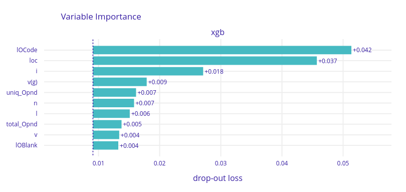
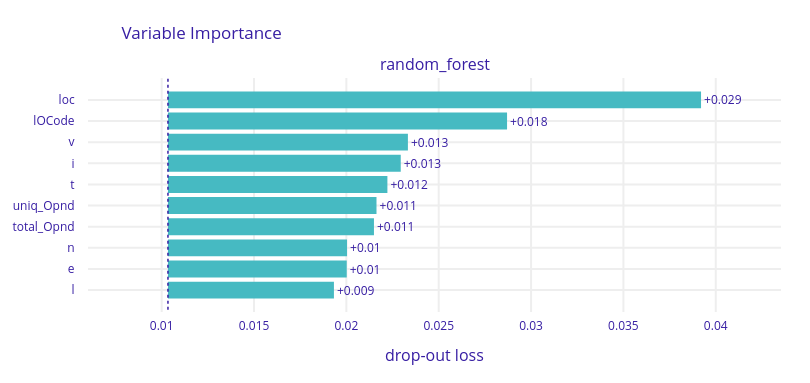
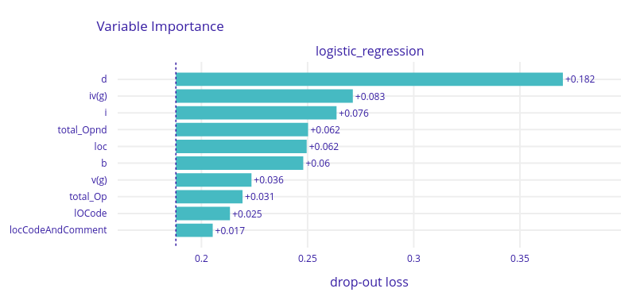
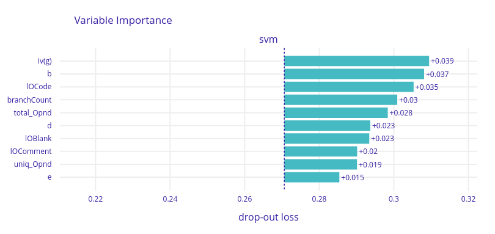
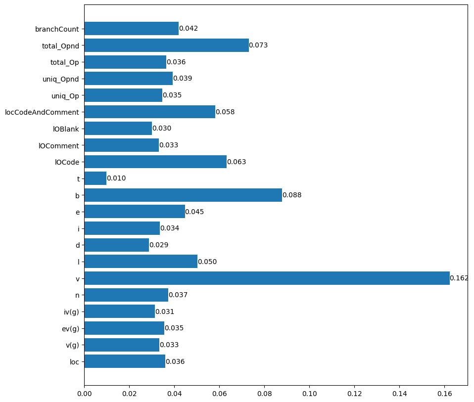
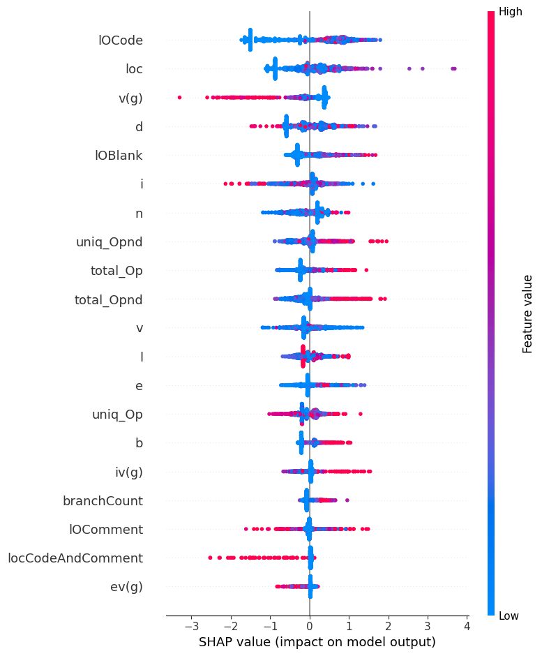

# HW 6 - Szymon Sadkowski

### 0. For the selected data set, train at least one tree-based ensemble model, e.g. random forest, gbdt, xgboost.

I used `kc1` dataset from openml and trained on it xgboost. Additionally for purposes of task 2, I trained logistic_regression, random_forest and support vector machine classifiers.

### 1. Calculate Permutation-based Variable Importance for the selected model.

  

We can see that for xgboost 3 most important features are `IOCode`, `loc` and `i` with some margin to other features.

### 2. Train three more candidate models (different variable transformations, different model architectures, hyperparameters) and compare their rankings of important features using PVI. What are the differences? Why?

    
    
  

We can observe that rankings obtained from xgboost and random_forest are much more similar then then logistic_regression and svm. For tree ensemble models variable `loc` and `IOCode` stay in top 2 most important features. For linear regression and svm there are no such obvious similarities, apart from variable `iv(g)` placed in top 2 most important variables.  
  
We might expect that as both xgboost and random_forest are tree ensemble models which is not the case for linear regression and svm.  
Additionally all models except from svm find that some variables are much more important then other.

There can be many reasons why from different models we obtain different feature rankings.
1. Each model can be seen as unique view of data. Therefore variable imporance will naturally differ.
2. Different model architectures (ex. xgboost and logistic regression) have different expressive power and can caputure different interactions therefore variable imporance will differ.
3. Some models provide better fit for then others. Which might impact their abaility to infer varaible imporance. This especially might be the case in svm model which has much higher loss then other models. High loss means that model is not good fit for the data and is missing important variable interactions therefore their imporance. (Mean averagre predictor can be seen as having all variable imporance the same)

### 3. For the tree-based model from (1), compare PVI with: 

#### A) the traditional feature importance measures for trees: Gini impurity etc.; what is implemented in a given library: see e.g. the `feature_importances_` attribute in `xgboost` and `sklearn`.

  
  

Xgboost pvi top 5 most influencial are `IOCode`, `loc`, `i`, `v(g)`, `uniq_Opend`.
Xgboost Gini imprtance top 5 most influencial are `v`, `v`, `total_Opnd`, `IOCode`, `IocCodeAndComment`.

So we have `v(g)` in top5 most important variables intersection but the results are very different.

#### B) [in Python] SHAP variable importance based on the TreeSHAP algorithm available in the `shap` package. 

  
  

When we compare xgboost pvi and shap based importance results are much more similar.
We have the same top 2 most important variables in the same order and `v(g)` is in both charts placed in top 4 most infuencial variables.